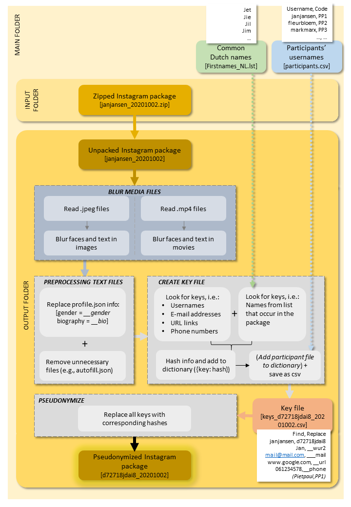

# Miffy

Pseudonimizing data download packages from Instagram.


## Prerequisites

Before running the software, the following steps need to be taken:

1. **[Clone repository](#clone-repository)**
2. **[Download data package](#download-data-package)**
3. **[Create input folder](#input-folder)**
    
    
### Clone repository

To clone this repository, you'll need *Git installed* on your computer. When Git is installed, run the following code in the command line:

```
# Clone this repository
$ git clone https://github.com/UtrechtUniversity/miffy

# Go into the repository
$ cd miffy

# Install dependencies
pip install -r requirements.txt 

```

### Download data package

To download your Instagram data package:

1. Go to www.instagram.com and log in
2. Click on your profile picture, go to *Settings* and *Privacy and Security*
3. Scroll to *Data download* and click *Request download*
4. Enter your email adress and click *Next*
5. Enter your password and click *Request download*

Make sure that the data download package is saved as **username_YYYYMMDD.zip** (i.e., Instagram handle and date of download).


### Input folder

After the repository is cloned and the data package is downloaded, create a new folder within the cloned repository (e.g., 'input'). Here, the following files need to be saved:
* ***Data package***: Zipped data download package(s) (username_YYYYMMDD.zip)
* ***First names file***: A list with the most common (Dutch) names (Firstnames_NL.lst)
* (***Participant file***: Only necessary for participant based studies. In this file, all participants' usernames and participant codes are listed (participants.csv).)


## Run software

Run the program with arguments `-i` for input folder (e.g., 'input') and ` -o` output folder (e.g., 'output'):

```
$ python anonymizing_instagram_uu.py -i input -o output

```

An overview of what the program does is showed below:


The output will be a copy of the zipped data download package with all names, usernames, email addresses, phone numbers anonymized, and pictures and videos blurred. This pseudonimized data download package is saved in the output folder.


## Built With

The blurring of text in images and videos is based on a pre-trained version of the [EAST model](https://github.com/argman/EAST).


## Authors

See also the list of [contributors](https://github.com/your/project/contributors) who participated in this project.


## License

This project is licensed under ...


## Acknowledgments

* Hat tip to anyone whose code was used
* Inspiration
* etc


Download a pretrained version of the EAST model [here](https://www.pyimagesearch.com/2018/08/20/opencv-text-detection-east-text-detector/).
